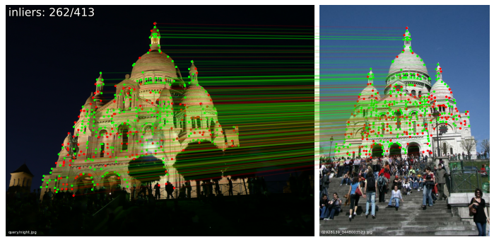
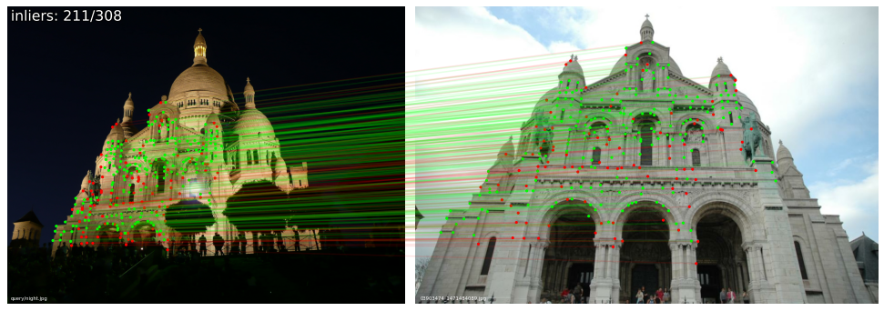
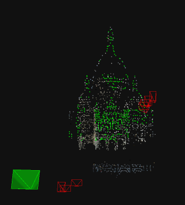
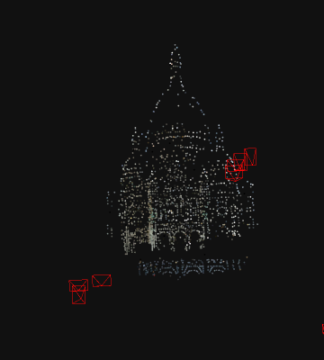
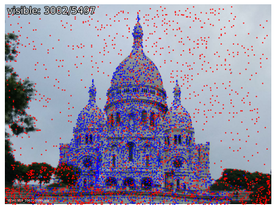
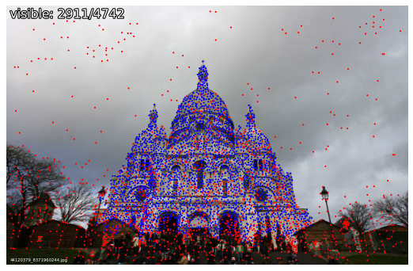
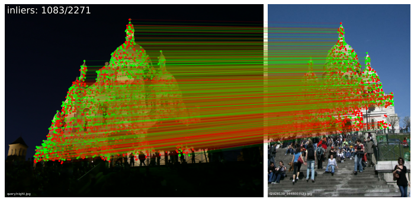
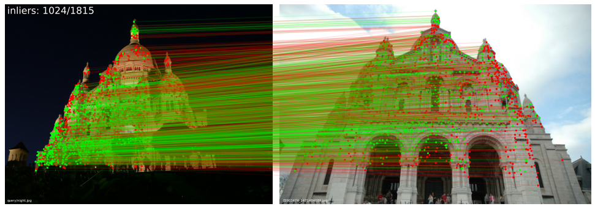
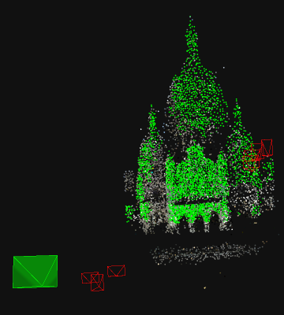
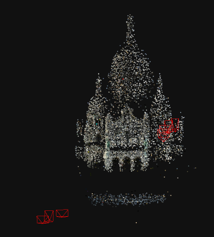

# HLoc - Hierarchical Localization Toolbox (Customized)

This is a **modified version** of the original [Hierarchical-Localization (hloc)](https://github.com/cvg/Hierarchical-Localization) toolbox, extended with state-of-the-art feature matching capabilities for improved visual localization performance.

## Key Modifications

We have integrated the following advanced matchers into the hloc pipeline:

- **GIM-LightGlue** matcher (standalone)
- **RoMa + GIM-LightGlue** matcher (RoMa for robust keypoint refinement + GIM-LightGlue matching)

These additions enable denser, more reliable matches and better 3D reconstructions, particularly in challenging scenes with low texture or repetitive patterns.

## Quick Demo

Explore the different configurations in the updated [`demo.ipynb`](demo.ipynb) notebook.

## Experimental Results

### 1. GIM-LightGlue Matcher
Uses GIM-LightGlue as the primary matching backbone.

| Stage              | Results                                                                 |
|--------------------|-------------------------------------------------------------------------|
| Matching           |    |
| Reconstruction     |                             |

### 2. RoMa + GIM-LightGlue Matcher
Combines RoMa for enhanced keypoint detection/refinement with GIM-LightGlue matching.

| Stage              | Results                                                                 |
|--------------------|-------------------------------------------------------------------------|
| Keypoints          |   |
| Matching           |    |
| Reconstruction     |                        |

## Observations

- **GIM-LightGlue** significantly increases the number of successful matches while preserving the original SuperPoint keypoints, resulting in denser correspondences and improved reconstruction quality.

- **RoMa + GIM-LightGlue** delivers substantially superior performance: it discovers many additional matches from the original keypoints and generates a large number of entirely new matches thanks to the newly detected high-quality keypoints (particularly effective in low-texture). This leads to dramatically higher match counts, significantly more inliers, denser point clouds, and markedly more accurate 3D reconstructions.
